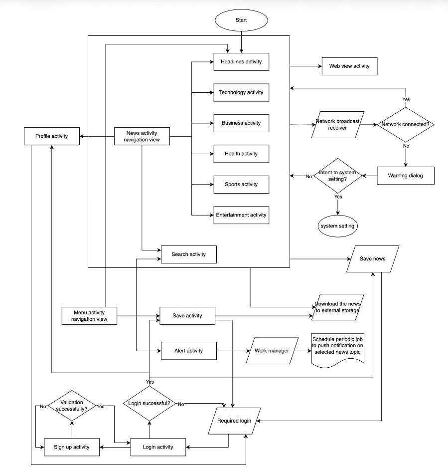
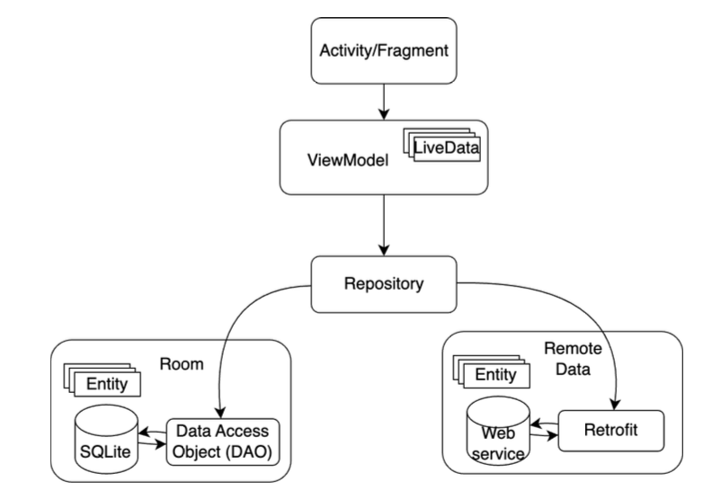
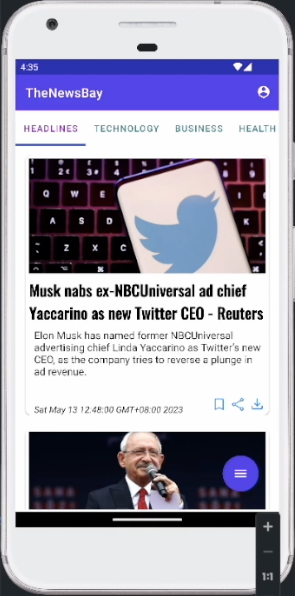
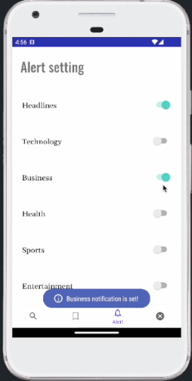

# TheNewsBay

Android news app: browse articles by category, save articles, and receive topic-based push notifications. Built for COMP4521 Mobile Application Development.

## App flow

End-to-end user flow — news navigation, login/sign-up, save, alerts, and network handling — is shown below.

## Architecture & data storage

The app uses **MVVM** with a **Repository** layer. The View (Activity/Fragment) observes **LiveData** from the ViewModel; the ViewModel talks only to the Repository, which abstracts local and remote data.

- **Local:** [Room](ref/data-storage-mechanism.png) (SQLite) with DAOs — two DBs: `saved_article_db` (readers ↔ articles) and `account_db` (user ↔ saved newspapers).
- **Remote:** Retrofit + REST API for news.
- **Background:** Work Manager (periodic topic alerts), Notification Manager; alert preferences in SharedPreferences (account-aware).
- **Connectivity:** BroadcastReceiver in News/Search fragments; AlertDialog with intent to system network settings when offline.

## Features

- News by category (Headlines, Technology, Business, Health, Sports, Entertainment) and search
- Login / sign-up; per-account saved articles
- Topic-based push notifications (Work Manager, daily periodic fetch + notify on selected topics)
- WebView for full article reading; save articles to local DB and to external storage

## App UI

